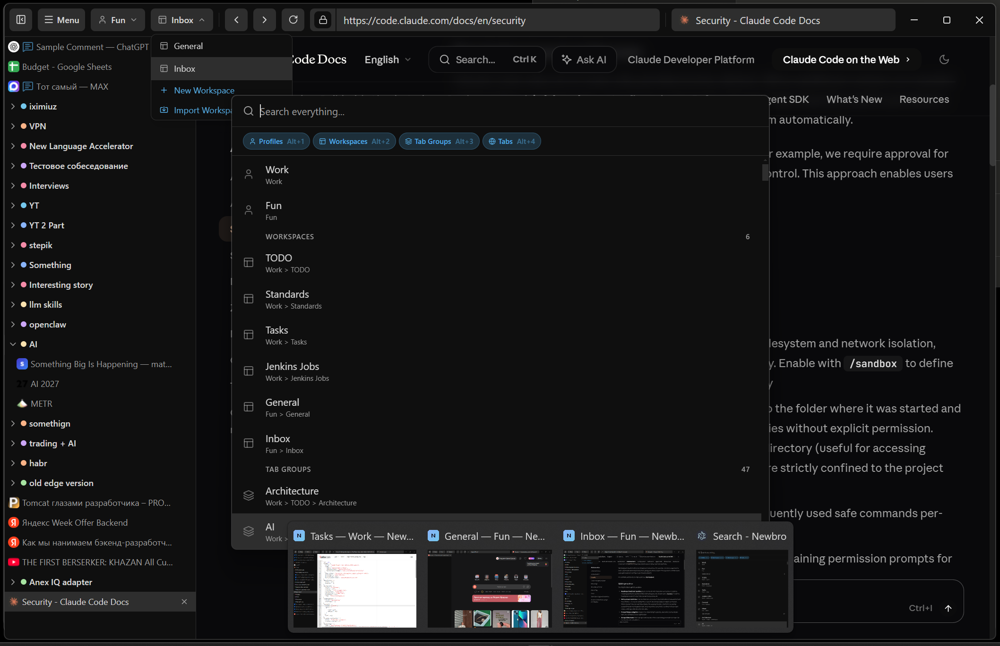
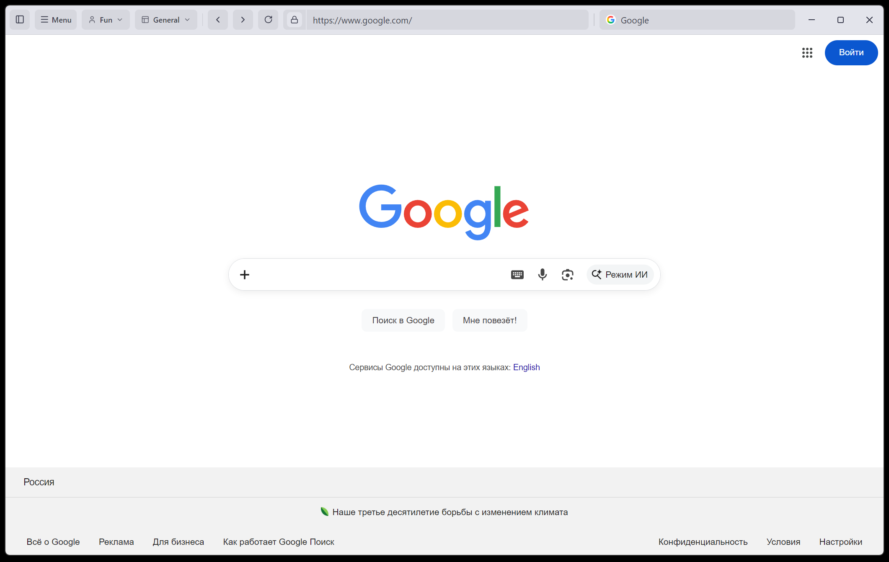
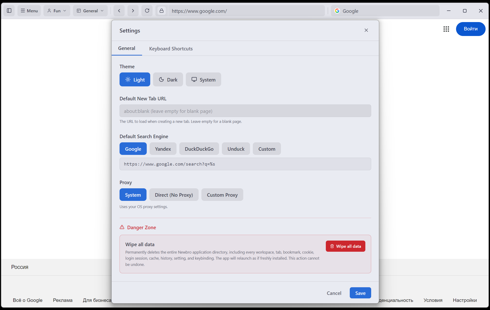

# Newbro Browser

A workspace-based desktop browser built with Electron, React and TypeScript. Organize your tabs into colorful groups across multiple isolated workspaces and profiles.



## Features

- **Profiles** — separate session partitions keep cookies and logins isolated
- **Workspaces** — switch between independent workspaces (work, personal, projects) from the top bar
- **Tab groups** — color-coded, collapsible groups with drag-and-drop reordering
- **Command palette** — fuzzy-search all commands, tabs, groups and workspaces
- **Tab comments** — annotate any tab with a short note
- **Import workspace** — bring tab groups in from exported browser bookmarks

<details>
<summary>More screenshots</summary>

**Light mode**



**Settings dialog**



</details>

## Tech stack

Electron 34 · React 19 · TypeScript · Vite · Tailwind CSS · Zustand · dnd-kit · Fuse.js

## Getting started

```bash
npm install
npm run dev
```

## Building

```bash
npm run dist:win    # Windows installer
npm run dist:mac    # macOS dmg
npm run dist:linux  # Linux AppImage
```
